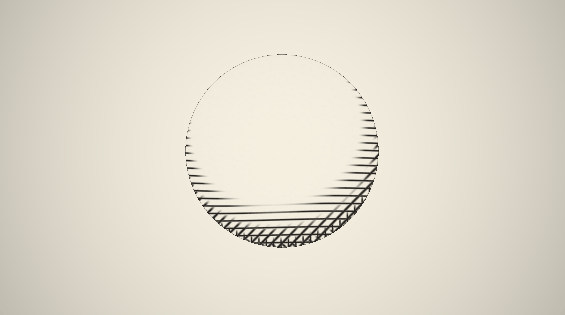

# Real-Time Cross-Hatching Shader

> 한국어 설명은 [여기](#korean)를 참고하세요.

> A GLSL shader that simulates traditional pen-and-ink hatching in real time,  
> driven by surface luminance — darker areas accumulate denser line layers,  
> lighter areas stay clean, mimicking how artists build tone with line density.

**[→ Live Demo on Shadertoy](https://www.shadertoy.com/view/7f2GWR)**

---

## Preview


> GIF가 안 보이면 위 Shadertoy 링크에서 직접 확인하세요.

---

## What it does

Traditional cross-hatching is a drawing technique where artists layer lines
at different angles to build up shadow and form. This shader replicates that
process procedurally:

| Luminance range | Hatch layers active |
|---|---|
| Bright (lit) | 0 layers — clean paper |
| Mid-tone | 1–2 layers (0°, 45°) |
| Dark | 3 layers (0°, 45°, 90°) |
| Deepest shadow | 4 layers (0°, 45°, 90°, 135°) |

Each line family is slightly displaced by value noise to break the mechanical
regularity — giving the hand-drawn feel that separates this from a simple
stripe pattern.

---

## Technique

```
Surface luminance
      │
      ▼
4 smooth thresholds  ──►  4 rotated line families (45° apart)
      │                          │
      └──── blended together ────┘
                  │
                  ▼
          ink / paper mix
```

- Line anti-aliasing via `fwidth()` + `smoothstep` — no jagged edges at any resolution
- Noise displacement along hatch direction for organic feel
- Silhouette edge darkening (rim shadow)
- Subtle paper texture noise over the whole surface

---

## Parameters

| Name | Default | Effect |
|---|---|---|
| `LINE_FREQ` | 80.0 | Line density — higher = finer hatching |
| `LINE_WIDTH` | 0.04 | Stroke thickness |
| `NOISE_AMP` | 0.018 | Hand-drawn wobble amount |
| `TONE_STEPS` | 4 | Max hatch layers in darkest areas |
| `PAPER_COLOR` | warm off-white | Background / lit surface color |
| `INK_COLOR` | near-black | Line color |

---

## How to run

1. Go to [shadertoy.com](https://www.shadertoy.com) and click **New Shader**
2. Delete the default code and paste `shader.glsl`
3. Press ▶ (Alt+Enter) — the sphere appears immediately

No dependencies, no build step.

---

## Porting to Unity (HLSL)

| GLSL | HLSL |
|---|---|
| `iTime` | `_Time.y` |
| `iResolution` | `_ScreenParams.xy` |
| `texture2D(tex, uv)` | `tex2D(tex, uv)` |
| `fwidth()` | `fwidth()` (same) |
| `fragCoord` | `i.pos.xy` (screen pos) |

Works as a **post-process shader** (Image Effect) or a **surface shader**
with screen-space UV passed from the vertex stage.

---

## References

- Praun et al. — *Real-Time Hatching*, SIGGRAPH 2001  
  (Original TAM-based approach; this shader achieves a similar result without textures)
- Inigo Quilez — SDF and noise functions ([iquilezles.org](https://iquilezles.org))

---

## License

MIT — use freely in personal or commercial projects.

---

<a name="korean"></a>
## 한국어 요약

실시간 크로스해칭 셰이더입니다. 표면의 밝기(luminance)에 따라 펜 드로잉 스타일의 해칭 선이 자동으로 쌓입니다.

**동작 방식**
- 밝은 영역: 선 없음 — 깨끗한 종이 느낌
- 중간 톤: 1~2개 레이어 (0°, 45°)
- 어두운 영역: 3~4개 레이어 교차 (0°, 45°, 90°, 135°)
- 노이즈 변위로 손으로 그린 듯한 떨림 표현

**활용**
- Shadertoy에서 바로 실행 가능 (빌드 불필요)
- Unity HLSL로 이식 가능 — 포스트 프로세스 또는 서피스 셰이더로 활용
- NPR(Non-Photorealistic Rendering) 스타일의 게임에 적합

**배경**
Praun et al. (SIGGRAPH 2001)의 TAM 기반 접근법을 텍스처 없이 순수 GLSL로 재구현하였습니다.
