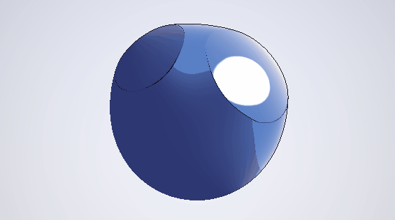

# Toon Shading + Rim Light

> 한국어 설명은 [여기](#korean)를 참고하세요.

**[→ Live Demo on Shadertoy](https://www.shadertoy.com/view/sfj3WR)**



---

## What it does

A cel-shading shader with several features that most basic toon implementations miss.

| Feature | Detail |
|---|---|
| Stepped diffuse | Hard tone bands via `smoothstep` — not simple posterization |
| Hue shift per zone | Shadow shifts cool (blue), highlight shifts warm (white) — mimics real anime painting |
| Rim light | Fresnel-based, colored, only on light-facing hemisphere |
| Specular | Hard cutoff anime-style dot, not Phong falloff |
| Outline | Screen-space normal discontinuity — no geometry duplication needed |

---

## The key insight

Most toon shaders just posterize brightness into bands.  
Real cel animation uses **hue shifts** between tone zones — shadows go slightly
blue/purple, highlights go warm white. This shader replicates that.

```
NdotL (half-lambert)
      │
      ▼
bandStep() ──► tone zone
                  │
         ┌────────┼────────┐
         ▼        ▼        ▼
      SHADOW   MIDTONE  HIGHLIGHT
     (cool)   (base)    (warm)
         └────────┼────────┘
                  │
              + Rim Light (Fresnel)
              + Specular (hard cutoff)
              + Outline (ddx/ddy normals)
```

---

## Parameters

| Name | Default | Effect |
|---|---|---|
| `BASE_COLOR` | blue | Main surface color |
| `SHADOW_COLOR` | dark blue | Cool shadow zone |
| `HIGHLIGHT_COLOR` | warm white | Lit zone |
| `RIM_COLOR` | warm orange | Rim light color |
| `TONE_BANDS` | 3.0 | Number of diffuse steps |
| `RIM_POWER` | 3.5 | Rim falloff — higher = thinner |
| `RIM_STRENGTH` | 0.75 | Rim intensity |
| `SPEC_SIZE` | 0.97 | Specular dot size |
| `OUTLINE_THRESH` | 0.28 | Outline sensitivity |

---

## How to run

1. Go to [shadertoy.com](https://www.shadertoy.com) → New Shader
2. Paste `shader.glsl` → Alt+Enter

---

## Porting to Unity (HLSL)

| Approach | Notes |
|---|---|
| Surface shader + custom lighting | Replace `bandStep` diffuse in `LightingToon()` |
| Post-process outline | Use G-buffer normals + Roberts cross edge detection |
| URP | Custom `UniversalRenderPipelineAsset` + renderer feature for outline pass |

---

## References

- Gooch et al. — *A Non-Photorealistic Lighting Model for Automatic Technical Illustration*, SIGGRAPH 1998
- Guilty Gear Xrd GDC talk — *"The 'Guilty Gear Xrd' Art Style"* (2015) — hue-shift technique

---

## License

MIT — use freely in personal or commercial projects.

---

<a name="korean"></a>
## 한국어 요약

툰 셰이딩 + 림 라이트 셰이더입니다. 단순한 밝기 단계화를 넘어, 실제 셀 애니메이션의 채색 방식을 구현했습니다.

**핵심 기법**
- 섀도우 존은 차갑게(파란 계열), 하이라이트 존은 따뜻하게(흰 계열) 색상이 이동 — 실제 애니메이션 채색 방식
- Fresnel 기반 림 라이트: 빛을 향한 면에만 적용, 색상 조절 가능
- 스크린 스페이스 노멀 불연속성으로 아웃라인 감지 — 지오메트리 복제 불필요
- 애니메이션 스타일 하드 스페큘러 (Phong 감쇠 없음)

**활용**
- Unity Surface Shader의 커스텀 라이팅 모델로 이식 가능
- URP 렌더러 피처로 아웃라인 패스 분리 가능
- Guilty Gear, 블루 프로토콜 류의 애니메이션 렌더링 스타일에 적합

**배경**
게임에서 가장 많이 쓰이는 NPR 기법 중 하나인 셀 셰이딩을, 단순 구현을 넘어 실제 애니메이션 제작 방식을 분석해 재현했습니다.